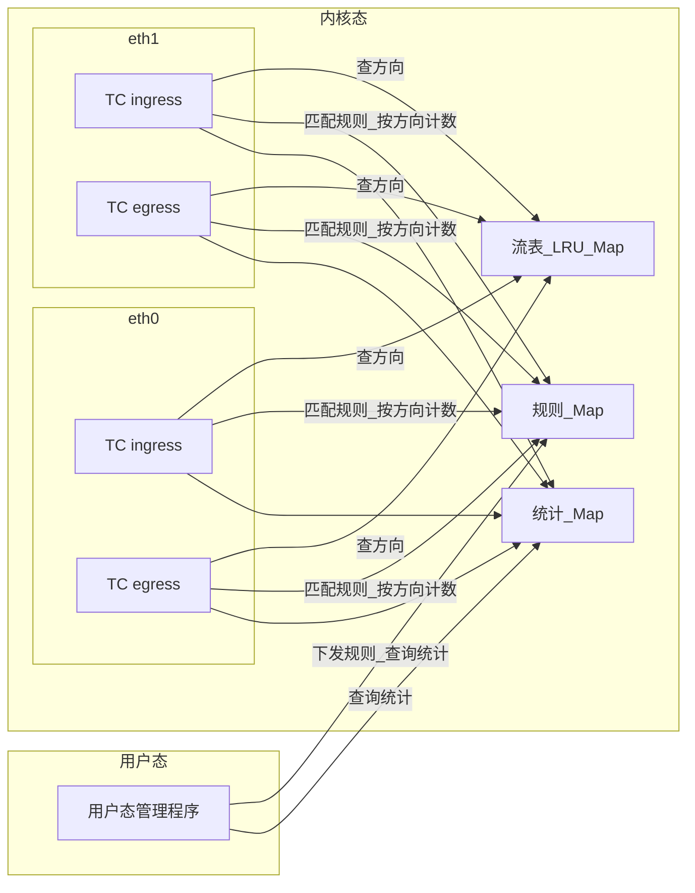

# Traffic Meter

traffic meter 是一个基于 BPF TC（Traffic Control）实现的流量统计模块。包含内核 BPF 程序和用户态管理程序。

用户态管理程序用于 1.下发需要统计流量的 IP 网段或者 IP 地址、2. 从内核态 BPF 程序中查询已下发的 IP 地址、网段、以及统计的流量信息。

内核 BPF 程序挂载到网卡的 TC ingress 和 egress 两个方向，解析报文 IP 地址，通过自建流表判定上下行方向并统计流量。

## 1. 概述

### 1.1 目标场景

- 按单 IP 或 IP 网段（CIDR）统计**本机所有网口**的流量，**基于流表区分上下行（rx/tx）**：TC BPF 程序同时挂载到 **ingress 和 egress**，维护一张 LRU 流表，以流的**第一个报文方向**作为 original（tx/上行）方向，反向报文为 reply（rx/下行）方向。由于同时看到入站和出站报文，对于 `0.0.0.0/0` 等通配规则也能正确区分 rx/tx。分别记录包数与字节数，统计结果为所有网口汇总，不按网口区分；**同时支持 IPv4 与 IPv6**。

### 1.2 技术选型

- **TC BPF（Traffic Control BPF）**：挂载到 clsact qdisc 的 **ingress + egress** 两个方向，能同时看到入站和出站报文，是实现双向流量统计的基础。性能优于用户态统计，略低于 XDP（已完成 sk_buff 分配），但能覆盖双向。
- **内核态统计**：统计在 BPF 程序内完成，避免把报文拷贝到用户态，减少 CPU 与内存开销。
- **BPF Map**：规则与统计结果存放在内核 Map 中，用户态通过 libbpf 读写，实现配置下发与查询。
- **自建 BPF 流表**：使用 `BPF_MAP_TYPE_LRU_HASH` 在 TC BPF 层维护流表，通过首包方向判定上下行，无需依赖内核 conntrack。TCP SYN/SYN-ACK 检测确保连接重建后方向正确重置。

---

## 2. 系统架构

### 2.1 组件关系

- **一套 Map、多口共享**：全机仅**一套**规则 Map、统计 Map 与流表 Map；同一份 TC BPF 程序挂载到多个网口的 ingress + egress 时，各方向上的程序访问同一套 Map，统计结果为所有网口汇总。



### 2.2 数据流

- **报文路径**：任意网口的入站报文经 TC ingress hook、出站报文经 TC egress hook → BPF 解析 IP 头、提取源/目的 IP 与 L4 端口 → **构造归一化 flow key 并查询流表（LRU Map）**：首包则插入条目记录 orig_src（TCP SYN/SYN-ACK 会强制覆盖以处理重连），后续包与 orig_src 比较判定 original/reply 方向 → 在**同一套**规则 Map 中对源/目的 IP 分别做 LPM 查找 → 若匹配则从 LPM value 读取规则前缀长度，重建规则 key → 按流方向在统计 Map 中递增：**original → tx**、**reply → rx** → 返回 TC_ACT_OK。由于 ingress + egress 同时挂载，双向报文都能看到，流表可正确判定方向。各网口报文更新同一组统计，得到**所有网口汇总**的流量。
- **管理路径**：用户态管理程序通过 libbpf 加载 BPF 目标文件得到一套 Map，向规则 Map 写入或删除条目（添加/删除需统计的 IP 或网段），**同时在统计 Map 中预创建/删除对应的零值条目**；从规则 Map 与统计 Map 读取当前规则列表及流量统计（即全机汇总结果）。

---

## 3. 内核 BPF 程序设计

### 3.1 挂载点与触发

- **挂载方式**：使用 TC BPF 挂载到 **clsact qdisc** 的 ingress 和 egress 两个方向。ingress 捕获入站报文，egress 捕获出站报文，二者共享同一套 BPF Map，使流表能同时看到双向流量。
- **桥接去重**：egress 方向在处理报文前检查 `skb->ingress_ifindex`：若非零且不等于当前 `skb->ifindex`，说明该报文是从另一接口经 bridge 转发而来，已在入口接口的 ingress 统计过，直接跳过以避免重复计数。
- **加载流程**：`load` 命令通过 libbpf 的 `bpf_tc_hook_create()` 创建 clsact qdisc（已存在则复用），再通过 `bpf_tc_attach()` 分别将 ingress 和 egress 两个 BPF 程序挂载到对应方向。
- **一套程序与一套 Map、多口挂载**：首次 `load` 时加载 BPF 目标文件（.o）并将 Map pin 到 bpffs；后续对其他网口执行 `load` 时，检测到已有 pin 文件，通过 `bpf_map__set_pin_path()` **复用已 pin 的 Map**，从而让多个网口上的 TC BPF 程序实例访问同一套 Map，统计结果为**所有已挂载网口的流量汇总**。

### 3.2 报文解析

- 在 TC BPF 中通过 `struct __sk_buff` 访问报文数据（`skb->data` / `skb->data_end`），解析以太网头，根据 `eth_proto` 识别 **IPv4（`ETH_P_IP`）或 IPv6（`ETH_P_IPV6`）**；支持 **单层 VLAN（802.1Q / 802.1AD）** 标签跳过；校验报文长度足够（eth + IP 头），解析对应 IP 头获取 **源 IP、目的 IP**（IPv4 为 4 字节，IPv6 为 16 字节）；不修改报文，仅读取。报文长度使用 `skb->len` 获取。
- **L4 端口提取**：对 TCP 和 UDP 报文进一步解析 L4 头获取源/目的端口，用于构造流表 key（五元组）；ICMP 及其他协议端口置零（流表仅用 IP 二元组 + 协议号区分流）。
- IPv4 与 IPv6 报文分别进入对应的流方向判定、规则匹配与统计分支（见 3.3、3.4、3.5）。

### 3.3 规则与匹配

- **规则存储**：使用 BPF LPM Map 存储"需统计"的条目；每条规则对应单 IP 或一个 CIDR 网段；**IPv4 与 IPv6 分别维护**，各一个 `BPF_MAP_TYPE_LPM_TRIE` Map（`rules_v4`、`rules_v6`）。
- **规则 Map 的 value**：value 为 `__u32`，存储该规则的 **前缀长度（prefixlen）**。TC BPF 程序做 LPM 查找后，从 value 读取匹配到的规则前缀长度，用于重建规则级别的 stats key（将主机 IP 按前缀长度掩码回网络地址），使统计按**规则**聚合而非按主机聚合。
- **匹配逻辑**：
  - 单 IP 视为 prefixlen=32（IPv4）或 128（IPv6）的 CIDR，统一使用 LPM 查找。
  - 网段（CIDR）：key 为 `prefixlen + addr`（IPv4：prefixlen 0–32，addr 4 字节；IPv6：prefixlen 0–128，addr 16 字节）；匹配时根据报文协议类型在对应规则表中对 **源 IP 和目的 IP 分别** 做 LPM 查找，取最长匹配（若存在）作为该报文所属规则。
- 一条报文的源 IP 和目的 IP **分别独立匹配**：若源 IP 匹配规则 A、目的 IP 匹配规则 B，则 A 和 B 的统计各自按**同一流方向**（original → tx / reply → rx）累加。

### 3.4 流表与方向判定

- **自建 BPF 流表**：TC BPF 程序维护一张 `BPF_MAP_TYPE_LRU_HASH` 类型的流表（IPv4 与 IPv6 各一张），由 ingress 和 egress 两个方向共享，用于跟踪连接并判定报文的上下行方向。
- **Flow Key 归一化**：为使同一条流的正反方向映射到同一个 key，对 IP 地址做排序归一化（`ip_lo <= ip_hi`），端口跟随各自的 IP：
  - **TCP / UDP**：五元组 `(ip_lo, ip_hi, port_lo, port_hi, protocol)`
  - **ICMP echo**：IP 二元组 + ICMP ID + 协议号 `(ip_lo, ip_hi, id, 0, protocol)`，请求和回复共享相同 ID
  - **其他协议**：二元组 + 协议号 `(ip_lo, ip_hi, 0, 0, protocol)`
- **方向判定逻辑**：
  1. 构造归一化 flow key，查询流表。
  2. **未命中（首包）**：以 `BPF_NOEXIST` 标志插入条目，记录 `orig_src`（首包源 IP）。该报文方向为 **original**。
  3. **已命中**：比较当前报文源 IP 与 `orig_src`，相同 → **original**，不同 → **reply**。
  4. **多 CPU 竞争**：`BPF_NOEXIST` 插入失败（`-EEXIST`）说明其他 CPU 先插入，再做一次 lookup 获取 winner 的记录来判断方向。
- **TCP SYN/SYN-ACK 重置**：检测到 TCP SYN 标志时（`th->syn == 1`，覆盖纯 SYN 和 SYN-ACK），用 `BPF_ANY` 强制覆盖流表条目，将 `orig_src` 更新为当前报文的源 IP。这确保 TCP 连接断开后在同一五元组上重建连接时，方向判定不会因旧条目而反转。
- **LRU 自动淘汰**：流表满时自动淘汰最久未访问的条目，无需手动清理或 timer。

### 3.5 统计

- **按规则 key 维护**：统计 Map 的 key 与规则 Map 的 key **完全一致**（即规则的 `prefixlen + network_addr`），每条规则在统计 Map 中有且仅有一条对应的统计条目。
- **上下行分计**：每条统计条目记录 **rx（接收/下行）** 与 **tx（发送/上行）** 两组独立计数器，方向由流表判定：
  - `tx_packets` / `tx_bytes`：报文处于 **original** 方向（与首包同向）时累加。
  - `rx_packets` / `rx_bytes`：报文处于 **reply** 方向（与首包反向）时累加。
  - 对于 `0.0.0.0/0` 规则：每条连接的首包方向记为 tx，应答方向记为 rx，rx/tx 分别反映各连接的入站和出站流量。
- **统计条目由用户态预创建**：用户态执行 `add` 命令时，在写入规则 Map 的同时，在统计 Map 中预创建一条零值 `{rx_packets=0, rx_bytes=0, tx_packets=0, tx_bytes=0}` 的条目（`BPF_NOEXIST`，不覆盖已有值）。这样 `stats` 命令即使在无流量时也能显示该规则。`del` 命令删除规则时同步删除对应的统计条目。
- **TC BPF 更新逻辑**：TC BPF 先通过流表得到方向，再匹配规则后，从 LPM value 读取 `matched_prefixlen`，将报文的主机 IP 按该前缀长度掩码（`build_rule_key_v4/v6`：使用编译期常量索引遍历每个字节，保留前缀位、清零主机位，避免 BPF 验证器拒绝的变量偏移栈访问），得到规则级别的 key，再在统计 Map 中 lookup 并按流方向原地递增（original → tx，reply → rx）。由于统计条目已被用户态预创建，TC BPF 仅做 lookup + update，不做 insert。
- **Map 类型**：使用 **per-CPU 类型**（`BPF_MAP_TYPE_PERCPU_HASH`），每 CPU 独立计数，无写竞争；用户态查询时对各 CPU 的 value 求和得到总 rx/tx 包数与字节数。

### 3.6 与用户态交互

- 通过 **BPF Map** 暴露规则表与统计表；流表为 TC BPF 内部使用，用户态不直接操作。无需额外 netlink 或字符设备。
- 程序与 Map 可由用户态通过 **pin 到 bpffs**（如 `/sys/fs/bpf/traffic_meter/`）实现持久化与多进程访问；或进程内 fd 传递（单进程管理、不 pin）。

---

## 4. 用户态管理程序设计

### 4.1 命令行参数设计

#### 内核 BPF 程序管理

| 子命令 | 必选参数 | 可选参数 | 说明 |
|--------|----------|----------|------|
| `load` | `--dev <网卡>` | `--object <bpf.o>`、`--bpffs-pin <路径>` | 加载 BPF 目标文件，创建 clsact qdisc 并将 TC BPF 程序挂载到指定网卡的 ingress 和 egress；若 Map 已 pin（先前已 load 过其他网口），自动复用已有 Map。`--object` 默认使用内置路径，`--bpffs-pin` 指定 Map pin 路径（默认 `/sys/fs/bpf/traffic_meter`）。 |
| `unload` | `--dev <网卡>` | — | 销毁网卡上的 clsact qdisc（同时移除 ingress 和 egress 的 TC BPF 程序）并释放资源（含 Map 的 unpin）。 |

#### IP 地址/网段配置

| 子命令 | 必选参数 | 可选参数 | 说明 |
|--------|----------|----------|------|
| `add` | `--ip-address <IP 或 CIDR>` | — | 向规则 Map 添加单 IP 或网段，**同时在统计 Map 预创建零值条目**；支持 **IPv4**（如 `192.168.1.1`、`10.0.0.0/24`）与 **IPv6**（如 `2001:db8::1`、`2001:db8::/32`）。对输入做严格校验：地址格式、前缀范围、主机位必须为零。规则与统计为全机一套，不需指定网口。 |
| `del` | `--ip-address <IP 或 CIDR>` | — | 从规则 Map 删除对应条目，**同时删除统计 Map 中对应的统计条目**（IPv4 或 IPv6）。 |
| `import` | `--file <path.json>` | — | 从指定 JSON 文件（使用 **json-c** 库解析）读取多条 IP/CIDR 规则（IPv4 或 IPv6）并批量写入规则 Map 及预创建统计条目。跳过无效条目并给出警告。 |

#### 查询（不需指定网口）

| 子命令 | 必选参数 | 可选参数 | 说明 |
|--------|----------|----------|------|
| `list` | — | — | 列出当前已下发的所有 IP/网段规则。 |
| `stats` | — | `--ip-address <IP 或 CIDR>` | 查询流量统计；不指定则输出全部规则的统计，指定则对该规则 key 做精确查找（支持 IPv4 与 IPv6）。每条规则分别显示 **rx**（reply 方向，下行）和 **tx**（original 方向，上行）的包数与字节数，字节数以人类可读格式（B/KiB/MiB/GiB/TiB）展示。 |

**JSON 文件格式约定**：根节点为数组，每项为一个 IP 或 CIDR 字符串；支持 **IPv4** 与 **IPv6** 地址或 CIDR。示例：

```json
[
  "192.168.1.2",
  "192.168.1.11/32",
  "192.168.1.0/24",
  "2001:db8::1",
  "2001:db8::/32"
]
```

### 4.2 职责

- **下发需统计的 IP/网段**：向内核 BPF 的规则 Map 添加或删除条目（单 IP 或 CIDR），同时同步维护统计 Map 中的对应条目。
- **查询**：从内核读取已下发的 IP、网段列表，以及各规则对应的流量统计（rx/tx 包数与字节数）。

### 4.3 与内核交互

- 使用 **libbpf** 加载 BPF 目标文件（.o），通过 `bpf_tc_hook_create()` + `bpf_tc_attach()` 将 `tc/ingress` 和 `tc/egress` 两个程序分别挂载到网卡的 clsact qdisc 上；`unload` 通过 `bpf_tc_hook_destroy()` 销毁 clsact qdisc。首次 `load` 将 Map pin 到 bpffs，后续 `load` 通过 `bpf_map__set_pin_path()` 复用已 pin 的 Map，从而将同一程序挂载到多个网口，所有网口共享同一套 Map。
- 通过 `bpf_map_update_elem` / `bpf_map_delete_elem` 增删规则（同时维护统计 Map）；通过 `bpf_map_lookup_elem` / 迭代（`bpf_map_get_next_key`，首次调用传入 `NULL` key 以正确处理全零 key 的情况）读取规则与统计（即全机汇总）。

### 4.4 功能

- **添加规则**：支持单 IP（如 `192.168.1.1`）和网段（如 `10.0.0.0/24`），写入规则 Map（value 为规则前缀长度 `__u32`），**同时在统计 Map 预创建零值的 per-CPU 条目**。
- **删除规则**：根据 IP 或 CIDR 标识删除规则 Map 条目，**同时删除统计 Map 中对应的条目**。
- **批量导入**：使用 json-c 解析 JSON 文件，逐条添加规则和统计条目，跳过无效条目并输出警告。
- **列表规则**：遍历规则 Map（`rules_v4` + `rules_v6`），输出当前已下发的所有 IP/网段。
- **查询统计**：遍历统计 Map（`stats_v4` + `stats_v6`）或按指定规则 key 精确查找；对 per-CPU Map 的各 CPU value 分别求和 rx（reply 方向）和 tx（original 方向）后展示 rx_packets/rx_bytes 与 tx_packets/tx_bytes（字节以人类可读格式）。

### 4.5 接口形式

- **CLI**：命令行工具（util-linux 风格，使用 `getopt_long`），子命令包括 `load`、`unload`、`add`、`del`、`import`、`list`、`stats`；网卡（`--dev`）仅用于 `load`/`unload`（TC BPF 挂载/卸载），规则与统计相关命令使用 `--ip-address`（IP 或 CIDR）、`--file`（JSON 路径）等，不需指定网口。

---

## 5. 数据结构与 BPF Map 设计

### 5.1 规则表示

- **统一表示**：
  - **IPv4**：单 IP 视为 prefixlen=32 的 CIDR；网段为 `prefixlen + addr`（prefixlen 0–32，addr 4 字节，如 24 + 10.0.0.0）。
  - **IPv6**：单 IP 视为 prefixlen=128 的 CIDR；网段为 `prefixlen + addr`（prefixlen 0–128，addr 16 字节）。
- **Key 设计**：IPv4 与 IPv6 各设一个 LPM Map（IPv4 key：`struct lpm_v4_key { __u32 prefixlen; __u8 addr[4]; }`；IPv6 key：`struct lpm_v6_key { __u32 prefixlen; __u8 addr[16]; }`）。
- **IP/CIDR 校验**：用户态使用 `inet_pton` 自动检测地址族（v4/v6），解析可选的 `/prefix` 后缀，验证前缀范围合法且主机位全零（如 `10.0.0.1/24` 会被拒绝，正确应为 `10.0.0.0/24`）。

### 5.2 Map 设计

| Map 名称 | 类型 | Key | Value | 用途 |
|----------|------|-----|-------|------|
| `rules_v4` | `BPF_MAP_TYPE_LPM_TRIE` | `struct lpm_v4_key` | `__u32`（prefixlen） | 存储 IPv4 规则；value 为规则前缀长度，供 TC BPF 重建规则 key |
| `rules_v6` | `BPF_MAP_TYPE_LPM_TRIE` | `struct lpm_v6_key` | `__u32`（prefixlen） | 存储 IPv6 规则 |
| `stats_v4` | `BPF_MAP_TYPE_PERCPU_HASH` | `struct lpm_v4_key` | `struct traffic_stats` | IPv4 per-CPU 统计；key 与规则 key 一致（prefixlen + 网络地址） |
| `stats_v6` | `BPF_MAP_TYPE_PERCPU_HASH` | `struct lpm_v6_key` | `struct traffic_stats` | IPv6 per-CPU 统计 |
| `flow_table_v4` | `BPF_MAP_TYPE_LRU_HASH` | `struct flow_key_v4` | `struct flow_info_v4` | IPv4 流表；归一化五元组/二元组为 key，记录首包 src IP |
| `flow_table_v6` | `BPF_MAP_TYPE_LRU_HASH` | `struct flow_key_v6` | `struct flow_info_v6` | IPv6 流表 |

- **全机一套 Map、多口共享**：全机仅创建**一套**规则 Map（IPv4 + IPv6）、统计 Map 与流表 Map；首次 `load` 创建并 pin 到 bpffs，后续 `load` 自动复用已 pin 的 Map。所有已挂载网口共享同一套 Map，统计结果为所有网口汇总。
- **规则 Map**：IPv4 与 IPv6 各一个 LPM Map，key 为 CIDR（prefixlen + addr），value 为 `__u32` 前缀长度。TC BPF 查找后读取 value 来重建规则级别的 stats key。
- **流表 Map**：IPv4 与 IPv6 各一个 LRU hash Map。Key 为归一化的流标识（TCP/UDP 五元组，ICMP 及其他协议用 IP 二元组 + 协议号）；Value 记录首包的源 IP（`orig_src`），用于后续报文的方向判定。LRU 自动淘汰最久未使用的条目，默认容量 65536。
- **统计 Map**：per-CPU hash，key 与规则 Map 的 key **完全一致**（prefixlen + 网络地址），value 为 `struct traffic_stats { __u64 rx_packets; __u64 rx_bytes; __u64 tx_packets; __u64 tx_bytes; }`，按流方向分计（original → tx，reply → rx）。条目由用户态 `add` 命令预创建（零值），TC BPF 仅做 lookup + 按方向原地更新。

### 5.3 用户态与内核共享结构

- 规则条目：与内核 LPM key 一致；IPv4 为 `struct lpm_v4_key { __u32 prefixlen; __u8 addr[4]; }`，IPv6 为 `struct lpm_v6_key { __u32 prefixlen; __u8 addr[16]; }`；用户态根据 `--ip-address` 解析为 v4 或 v6 后构造对应布局再 `bpf_map_update_elem`。
- 统计条目：`struct traffic_stats { __u64 rx_packets; __u64 rx_bytes; __u64 tx_packets; __u64 tx_bytes; }`，各 CPU 一份（per-CPU map）；用户态通过 `libbpf_num_possible_cpus()` 获取 CPU 数，分配 `ncpus * sizeof(struct traffic_stats)` 的缓冲区读取所有 CPU 后分别对 rx/tx 求和。需保证结构体对齐与 ABI 一致（无 padding 歧义）。
- 流表结构（TC BPF 内部使用，用户态不直接操作）：
  - IPv4 flow key：`struct flow_key_v4 { __u32 ip_lo, ip_hi; __u16 port_lo, port_hi; __u8 protocol; __u8 pad[3]; }`
  - IPv6 flow key：`struct flow_key_v6 { __u8 ip_lo[16], ip_hi[16]; __u16 port_lo, port_hi; __u8 protocol; __u8 pad[3]; }`
  - Flow info：`struct flow_info_v4 { __u32 orig_src; }` / `struct flow_info_v6 { __u8 orig_src[16]; }`

---

## 6. 接口与使用说明

### 6.1 用户态命令示例

- **内核 BPF 程序管理**（需指定网口，自动挂载 ingress + egress）
  - 首次加载：`traffic_meter load --dev eth0 --object traffic_meter.bpf.o`
  - 第二个网口（复用已有 Map）：`traffic_meter load --dev eth1 --object traffic_meter.bpf.o`
  - 自定义 pin 路径：`traffic_meter load --dev eth0 --object bpf.o --bpffs-pin /sys/fs/bpf/traffic_meter`
  - 卸载（销毁 clsact qdisc + unpin）：`traffic_meter unload --dev eth0`
- **IP 地址/网段配置**（规则与统计为全机一套，不需指定网口）
  - 添加规则：单 IP `traffic_meter add --ip-address 192.168.1.1`，网段 `traffic_meter add --ip-address 10.0.0.0/24`
  - 删除规则：`traffic_meter del --ip-address 192.168.1.1` 或 `traffic_meter del --ip-address 10.0.0.0/24`
  - 从 JSON 文件加载：`traffic_meter import --file rules.json`
- **查询**（不需指定网口）
  - 列出规则：`traffic_meter list`
  - 查询统计：`traffic_meter stats`（全部）或 `traffic_meter stats --ip-address 10.0.0.0/24`（指定某条规则精确查询）

### 6.2 配置项

- **网卡**：`--dev` 仅用于 `load`/`unload`，指定要挂载或卸载 TC BPF 的网口；规则与统计为全机一套 Map，`add`/`del`/`import`/`list`/`stats` 不需指定网口。
- **Map 路径**：通过 `--bpffs-pin /sys/fs/bpf/traffic_meter` 指定（默认 `/sys/fs/bpf/traffic_meter`）。首次 `load` 创建此目录并 pin Map 文件；后续 `load` 自动检测并复用。

---

## 7. 依赖与运行环境

### 7.1 内核与工具链

- **内核版本**：建议 5.4+（确保 TC BPF、LPM Map、LRU Hash Map、libbpf 支持稳定）；需开启 CONFIG_BPF_SYSCALL、CONFIG_NET_CLS_ACT（clsact qdisc）等。
- **编译**：clang/LLVM（含 BPF target）、libbpf 头库与链接、**json-c**（`import` 命令的 JSON 解析）；构建系统使用 **Meson**。
- **运行**：需挂载 bpffs：`mount -t bpf bpf /sys/fs/bpf`（若使用 pin）。

### 7.2 权限与部署

- **能力**：CAP_BPF、CAP_NET_ADMIN（加载 BPF、创建 clsact qdisc、挂载 TC filter）；或 root 运行。
- **部署**：用户态管理程序与 BPF 目标文件同机部署；先通过 `load` 命令加载 TC BPF 程序到指定网口（自动挂载 ingress + egress），再通过 CLI 下发规则与查询统计。

### 7.3 可选与后续扩展

- **多网口与统计维度**：当前设计为**所有口汇总统计**，一套 Map 共享到所有已挂载网口；若后续需**按网口分别查看**某 IP/网段的流量，可扩展为按网口分 Map 或在统计 key 中带 ifindex。
- **流表容量调优**：默认 `MAX_FLOWS_V4 = MAX_FLOWS_V6 = 65536`，高并发流场景可增大；LRU 自动淘汰保证不会 OOM，但过小会导致短连接频繁淘汰后重入被当作新首包。
- **IPv6 扩展头**：当前 IPv6 L4 端口提取仅处理固定头后紧跟的 nexthdr；若需跳过扩展头链，可后续增加扩展头遍历逻辑。
- **持久化**：规则与统计的持久化可通过用户态配置 + Map pin 或定期 dump 到文件实现，不在本期设计书强制要求。
