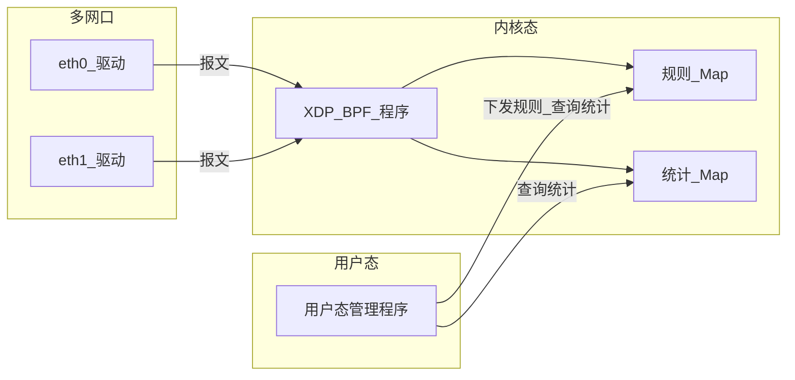

# traffic meter

traffic meter 是一个基于bpf xdp实现的流量统计模块。包含内核bpf程序和用户态管理程序。

用户态管理程序用于 1.下发需要统计流量的ip网段或者ip地址、2. 从内核态bpf程序中查询已下发的ip地址、网段、以及统计的流量信息

内核bpf程序通过解析报文ip地址。统计报文流量；

## 1. 概述

### 1.1 目标场景

- 按单 IP 或 IP 网段（CIDR）统计**本机所有网口**的流量（包数、字节数），统计结果为所有网口汇总，不按网口区分；**同时支持 IPv4 与 IPv6**。
- 适用于流量审计、按 IP/网段限速或计费、异常流量排查等场景。

### 1.2 技术选型

- **XDP（eXpress Data Path）**：在网卡驱动层或早于协议栈处处理报文，延迟低、吞吐高，适合做统计与过滤。
- **内核态统计**：统计在 BPF 程序内完成，避免把报文拷贝到用户态，减少 CPU 与内存开销。
- **BPF Map**：规则与统计结果存放在内核 Map 中，用户态通过 libbpf 读写，实现配置下发与查询。

---

## 2. 系统架构

### 2.1 组件关系

- **一套 Map、多口共享**：全机仅**一套**规则 Map 与统计 Map；同一份 XDP 程序挂载到多个网口时，各网口上的程序访问同一套 Map，统计结果为所有网口汇总。



### 2.2 数据流

- **报文路径**：任意网口收包 → 该网口驱动触发 XDP → BPF 解析 IP 头、提取源/目的 IP → 在**同一套**规则 Map 中做 LPM 查找 → 若匹配则从 LPM value 读取规则前缀长度，将主机 IP 掩码回网络地址重建规则 key → 用规则 key 在**同一套**统计 Map 中 lookup 并递增 packets/bytes → 返回 XDP_PASS 继续协议栈处理。因此各网口的报文都会更新同一组统计，得到**所有网口汇总**的流量。
- **管理路径**：用户态管理程序通过 libbpf 加载 BPF 目标文件得到一套 Map，向规则 Map 写入或删除条目（添加/删除需统计的 IP 或网段），**同时在统计 Map 中预创建/删除对应的零值条目**；从规则 Map 与统计 Map 读取当前规则列表及流量统计（即全机汇总结果）。

---

## 3. 内核 BPF 程序设计

### 3.1 挂载点与触发

- **挂载方式**：XDP 程序挂载到网卡，推荐 **原生模式（native）**，即驱动内执行 BPF；若无原生支持可使用 **generic/skb** 模式（协议栈前执行，性能略低）。
- **一套程序与一套 Map、多口挂载**：首次 `load` 时加载 BPF 目标文件（.o）并将 Map pin 到 bpffs；后续对其他网口执行 `load` 时，检测到已有 pin 文件，通过 `bpf_map__set_pin_path()` **复用已 pin 的 Map**（`BPF_OBJ_GET`），从而让多个网口上的 XDP 程序实例访问同一套 Map，统计结果为**所有已挂载网口的流量汇总**，无需按网口区分 Map。

### 3.2 报文解析

- 在 XDP 中解析以太网头，根据 `eth_proto` 识别 **IPv4（`ETH_P_IP`）或 IPv6（`ETH_P_IPV6`）**；支持 **单层 VLAN（802.1Q / 802.1AD）** 标签跳过；校验报文长度足够（eth + IP 头），解析对应 IP 头获取 **源 IP、目的 IP**（IPv4 为 4 字节，IPv6 为 16 字节）；不修改报文，仅读取。
- IPv4 与 IPv6 报文分别进入对应的规则匹配与统计分支（见 3.3、5.1）。

### 3.3 规则与匹配

- **规则存储**：使用 BPF LPM Map 存储"需统计"的条目；每条规则对应单 IP 或一个 CIDR 网段；**IPv4 与 IPv6 分别维护**，各一个 `BPF_MAP_TYPE_LPM_TRIE` Map（`rules_v4`、`rules_v6`）。
- **规则 Map 的 value**：value 为 `__u32`，存储该规则的 **前缀长度（prefixlen）**。XDP 程序做 LPM 查找后，从 value 读取匹配到的规则前缀长度，用于重建规则级别的 stats key（将主机 IP 按前缀长度掩码回网络地址），使统计按**规则**聚合而非按主机聚合。
- **匹配逻辑**：
  - 单 IP 视为 prefixlen=32（IPv4）或 128（IPv6）的 CIDR，统一使用 LPM 查找。
  - 网段（CIDR）：key 为 `prefixlen + addr`（IPv4：prefixlen 0–32，addr 4 字节；IPv6：prefixlen 0–128，addr 16 字节）；匹配时根据报文协议类型在对应规则表中对 **源 IP 和目的 IP 分别** 做 LPM 查找，取最长匹配（若存在）作为该报文所属规则。
- 一条报文的源 IP 和目的 IP **分别独立匹配**：若源 IP 匹配规则 A、目的 IP 匹配规则 B，则 A 和 B 的统计各自累加。

### 3.4 统计

- **按规则 key 维护**：统计 Map 的 key 与规则 Map 的 key **完全一致**（即规则的 `prefixlen + network_addr`），每条规则在统计 Map 中有且仅有一条对应的统计条目。
- **统计条目由用户态预创建**：用户态执行 `add` 命令时，在写入规则 Map 的同时，在统计 Map 中预创建一条零值 `{packets=0, bytes=0}` 的条目（`BPF_NOEXIST`，不覆盖已有值）。这样 `stats` 命令即使在无流量时也能显示该规则。`del` 命令删除规则时同步删除对应的统计条目。
- **XDP 更新逻辑**：XDP 匹配到规则后，从 LPM value 读取 `matched_prefixlen`，将报文的主机 IP 按该前缀长度掩码（`build_rule_key_v4/v6`：使用编译期常量索引遍历每个字节，保留前缀位、清零主机位，避免 BPF 验证器拒绝的变量偏移栈访问），得到规则级别的 key，再在统计 Map 中 lookup 并原地递增 `packets` 和 `bytes`。由于统计条目已被用户态预创建，XDP 仅做 lookup + update，不做 insert。
- **Map 类型**：使用 **per-CPU 类型**（`BPF_MAP_TYPE_PERCPU_HASH`），每 CPU 独立计数，无写竞争；用户态查询时对各 CPU 的 value 求和得到总包数/总字节数。

### 3.5 与用户态交互

- 通过 **BPF Map** 暴露规则表与统计表；无需额外 netlink 或字符设备。
- 程序与 Map 可由用户态通过 **pin 到 bpffs**（如 `/sys/fs/bpf/traffic_meter/`）实现持久化与多进程访问；或进程内 fd 传递（单进程管理、不 pin）。

---

## 4. 用户态管理程序设计

### 4.1 命令行参数设计

#### 内核 BPF 程序管理

| 子命令 | 必选参数 | 可选参数 | 说明 |
|--------|----------|----------|------|
| `load` | `--dev <网卡>` | `--object <xdp.o>`、`--bpffs-pin <路径>` | 加载 XDP 目标文件并挂载到指定网卡；若 Map 已 pin（先前已 load 过其他网口），自动复用已有 Map 而非重新创建。`--object` 默认使用内置路径，`--bpffs-pin` 指定 Map pin 路径（默认 `/sys/fs/bpf/traffic_meter`）。 |
| `unload` | `--dev <网卡>` | — | 从网卡摘除 XDP 程序并释放资源（含 Map 的 unpin 或关闭）。 |

#### IP 地址/网段配置

| 子命令 | 必选参数 | 可选参数 | 说明 |
|--------|----------|----------|------|
| `add` | `--ip-address <IP 或 CIDR>` | — | 向规则 Map 添加单 IP 或网段，**同时在统计 Map 预创建零值条目**；支持 **IPv4**（如 `192.168.1.1`、`10.0.0.0/24`）与 **IPv6**（如 `2001:db8::1`、`2001:db8::/32`）。对输入做严格校验：地址格式、前缀范围、主机位必须为零。规则与统计为全机一套，不需指定网口。 |
| `del` | `--ip-address <IP 或 CIDR>` | — | 从规则 Map 删除对应条目，**同时删除统计 Map 中对应的统计条目**（IPv4 或 IPv6）。 |
| `import` | `--file <path.json>` | — | 从指定 JSON 文件（使用 **json-c** 库解析）读取多条 IP/CIDR 规则（IPv4 或 IPv6）并批量写入规则 Map 及预创建统计条目。跳过无效条目并给出警告。 |

#### 查询（不需指定网口）

| 子命令 | 必选参数 | 可选参数 | 说明 |
|--------|----------|----------|------|
| `list` | — | — | 列出当前已下发的所有 IP/网段规则。 |
| `stats` | — | `--ip-address <IP 或 CIDR>` | 查询流量统计；不指定则输出全部规则的统计，指定则对该规则 key 做精确查找（支持 IPv4 与 IPv6）。字节数以人类可读格式（B/KiB/MiB/GiB/TiB）展示。 |

**JSON 文件格式约定**：根节点为数组，每项为一个 IP 或 CIDR 字符串；支持 **IPv4** 与 **IPv6** 地址或 CIDR。示例：

```json
[
    "192.168.1.2",
    "192.168.1.11/32",
    "192.168.1.0/24",
    "2001:db8::1",
    "2001:db8::/32"
]
```

### 4.2 职责

- **下发需统计的 IP/网段**：向内核 BPF 的规则 Map 添加或删除条目（单 IP 或 CIDR），同时同步维护统计 Map 中的对应条目。
- **查询**：从内核读取已下发的 IP、网段列表，以及各规则对应的流量统计（包数、字节数）。

### 4.3 与内核交互

- 使用 **libbpf** 加载 XDP 目标文件（.o），得到一套规则 Map 与统计 Map 的 fd；首次 `load` 将 Map pin 到 bpffs，后续 `load` 通过 `bpf_map__set_pin_path()` 复用已 pin 的 Map，从而将同一程序挂载到多个网口，所有网口共享同一套 Map。
- 通过 `bpf_map_update_elem` / `bpf_map_delete_elem` 增删规则（同时维护统计 Map）；通过 `bpf_map_lookup_elem` / 迭代（`bpf_map_get_next_key`，首次调用传入 `NULL` key 以正确处理全零 key 的情况）读取规则与统计（即全机汇总）。

### 4.4 功能

- **添加规则**：支持单 IP（如 `192.168.1.1`）和网段（如 `10.0.0.0/24`），写入规则 Map（value 为规则前缀长度 `__u32`），**同时在统计 Map 预创建零值的 per-CPU 条目**。
- **删除规则**：根据 IP 或 CIDR 标识删除规则 Map 条目，**同时删除统计 Map 中对应的条目**。
- **批量导入**：使用 json-c 解析 JSON 文件，逐条添加规则和统计条目，跳过无效条目并输出警告。
- **列表规则**：遍历规则 Map（`rules_v4` + `rules_v6`），输出当前已下发的所有 IP/网段。
- **查询统计**：遍历统计 Map（`stats_v4` + `stats_v6`）或按指定规则 key 精确查找；对 per-CPU Map 的各 CPU value 求和后展示 packets 和 bytes（人类可读格式）。

### 4.5 接口形式

- **CLI**：命令行工具（util-linux 风格，使用 `getopt_long`），子命令包括 `load`、`unload`、`add`、`del`、`import`、`list`、`stats`；网卡（`--dev`）仅用于 `load`/`unload`，规则与统计相关命令使用 `--ip-address`（IP 或 CIDR）、`--file`（JSON 路径）等，不需指定网口。

---

## 5. 数据结构与 BPF Map 设计

### 5.1 规则表示

- **统一表示**：
  - **IPv4**：单 IP 视为 prefixlen=32 的 CIDR；网段为 `prefixlen + addr`（prefixlen 0–32，addr 4 字节，如 24 + 10.0.0.0）。
  - **IPv6**：单 IP 视为 prefixlen=128 的 CIDR；网段为 `prefixlen + addr`（prefixlen 0–128，addr 16 字节）。
- **Key 设计**：IPv4 与 IPv6 各设一个 LPM Map（IPv4 key：`struct lpm_v4_key { __u32 prefixlen; __u8 addr[4]; }`；IPv6 key：`struct lpm_v6_key { __u32 prefixlen; __u8 addr[16]; }`）。
- **IP/CIDR 校验**：用户态使用 `inet_pton` 自动检测地址族（v4/v6），解析可选的 `/prefix` 后缀，验证前缀范围合法且主机位全零（如 `10.0.0.1/24` 会被拒绝，正确应为 `10.0.0.0/24`）。

### 5.2 Map 设计

| Map 名称 | 类型 | Key | Value | 用途 |
|----------|------|-----|-------|------|
| `rules_v4` | `BPF_MAP_TYPE_LPM_TRIE` | `struct lpm_v4_key` | `__u32`（prefixlen） | 存储 IPv4 规则；value 为规则前缀长度，供 XDP 重建规则 key |
| `rules_v6` | `BPF_MAP_TYPE_LPM_TRIE` | `struct lpm_v6_key` | `__u32`（prefixlen） | 存储 IPv6 规则 |
| `stats_v4` | `BPF_MAP_TYPE_PERCPU_HASH` | `struct lpm_v4_key` | `struct traffic_stats` | IPv4 per-CPU 统计；key 与规则 key 一致（prefixlen + 网络地址） |
| `stats_v6` | `BPF_MAP_TYPE_PERCPU_HASH` | `struct lpm_v6_key` | `struct traffic_stats` | IPv6 per-CPU 统计 |

- **全机一套 Map、多口共享**：全机仅创建**一套**规则 Map（IPv4 + IPv6）与统计 Map；首次 `load` 创建并 pin 到 bpffs，后续 `load` 自动复用已 pin 的 Map。所有已挂载网口共享同一套 Map，统计结果为所有网口汇总。
- **规则 Map**：IPv4 与 IPv6 各一个 LPM Map，key 为 CIDR（prefixlen + addr），value 为 `__u32` 前缀长度。XDP 查找后读取 value 来重建规则级别的 stats key。
- **统计 Map**：per-CPU hash，key 与规则 Map 的 key **完全一致**（prefixlen + 网络地址），value 为 `struct traffic_stats { __u64 packets; __u64 bytes; }`。条目由用户态 `add` 命令预创建（零值），XDP 仅做 lookup + 原地更新。

### 5.3 用户态与内核共享结构

- 规则条目：与内核 LPM key 一致；IPv4 为 `struct lpm_v4_key { __u32 prefixlen; __u8 addr[4]; }`，IPv6 为 `struct lpm_v6_key { __u32 prefixlen; __u8 addr[16]; }`；用户态根据 `--ip-address` 解析为 v4 或 v6 后构造对应布局再 `bpf_map_update_elem`。
- 统计条目：`struct traffic_stats { __u64 packets; __u64 bytes; }`，各 CPU 一份（per-CPU map）；用户态通过 `libbpf_num_possible_cpus()` 获取 CPU 数，分配 `ncpus * sizeof(struct traffic_stats)` 的缓冲区读取所有 CPU 后求和。需保证结构体对齐与 ABI 一致（无 padding 歧义）。

---

## 6. 接口与使用说明

### 6.1 用户态命令示例

- **内核 BPF 程序管理**（需指定网口）
  - 首次加载：`traffic_meter load --dev eth0 --object traffic_meter.bpf.o`
  - 第二个网口（复用已有 Map）：`traffic_meter load --dev eth1 --object traffic_meter.bpf.o`
  - 自定义 pin 路径：`traffic_meter load --dev eth0 --object xdp.o --bpffs-pin /sys/fs/bpf/traffic_meter`
  - 卸载/摘除：`traffic_meter unload --dev eth0`
- **IP 地址/网段配置**（规则与统计为全机一套，不需指定网口）
  - 添加规则：单 IP `traffic_meter add --ip-address 192.168.1.1`，网段 `traffic_meter add --ip-address 10.0.0.0/24`
  - 删除规则：`traffic_meter del --ip-address 192.168.1.1` 或 `traffic_meter del --ip-address 10.0.0.0/24`
  - 从 JSON 文件加载：`traffic_meter import --file rules.json`
- **查询**（不需指定网口）
  - 列出规则：`traffic_meter list`
  - 查询统计：`traffic_meter stats`（全部）或 `traffic_meter stats --ip-address 10.0.0.0/24`（指定某条规则精确查询）

### 6.2 配置项

- **网卡**：`--dev` 仅用于 `load`/`unload`，指定要挂载或摘除 XDP 的网口；规则与统计为全机一套 Map，`add`/`del`/`import`/`list`/`stats` 不需指定网口。
- **Map 路径**：通过 `--bpffs-pin /sys/fs/bpf/traffic_meter` 指定（默认 `/sys/fs/bpf/traffic_meter`）。首次 `load` 创建此目录并 pin Map 文件；后续 `load` 自动检测并复用。

---

## 7. 依赖与运行环境

### 7.1 内核与工具链

- **内核版本**：建议 5.4+（确保 XDP、LPM Map、libbpf 支持稳定）；需开启 CONFIG_BPF_SYSCALL、CONFIG_XDP_SOCKETS 等。
- **编译**：clang/LLVM（含 BPF target）、libbpf 头库与链接、**json-c**（`import` 命令的 JSON 解析）；构建系统使用 **Meson**。
- **运行**：需挂载 bpffs：`mount -t bpf bpf /sys/fs/bpf`（若使用 pin）。

### 7.2 权限与部署

- **能力**：CAP_BPF、CAP_NET_ADMIN（加载 BPF、挂载 XDP、修改网卡）；或 root 运行。
- **部署**：用户态管理程序与 BPF 目标文件同机部署；先启动管理程序（加载并挂载 XDP、创建/打开 Map），再通过 CLI 下发规则与查询统计。

### 7.3 可选与后续扩展

- **多网口与统计维度**：当前设计为**所有口汇总统计**，一套 Map 共享到所有已挂载网口；若后续需**按网口分别查看**某 IP/网段的流量，可扩展为按网口分 Map 或在统计 key 中带 ifindex。
- **持久化**：规则与统计的持久化可通过用户态配置 + Map pin 或定期 dump 到文件实现，不在本期设计书强制要求。
